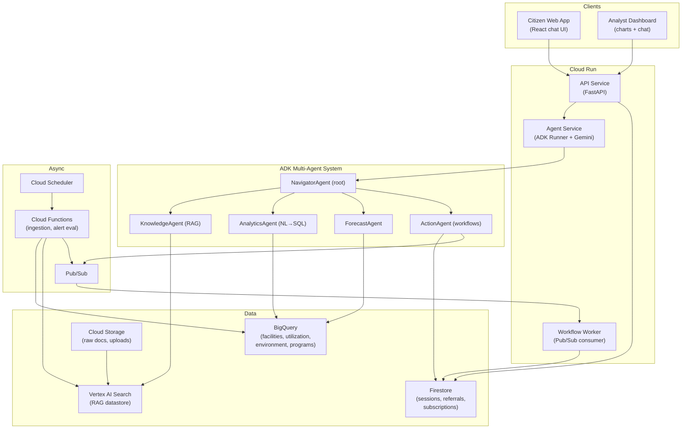
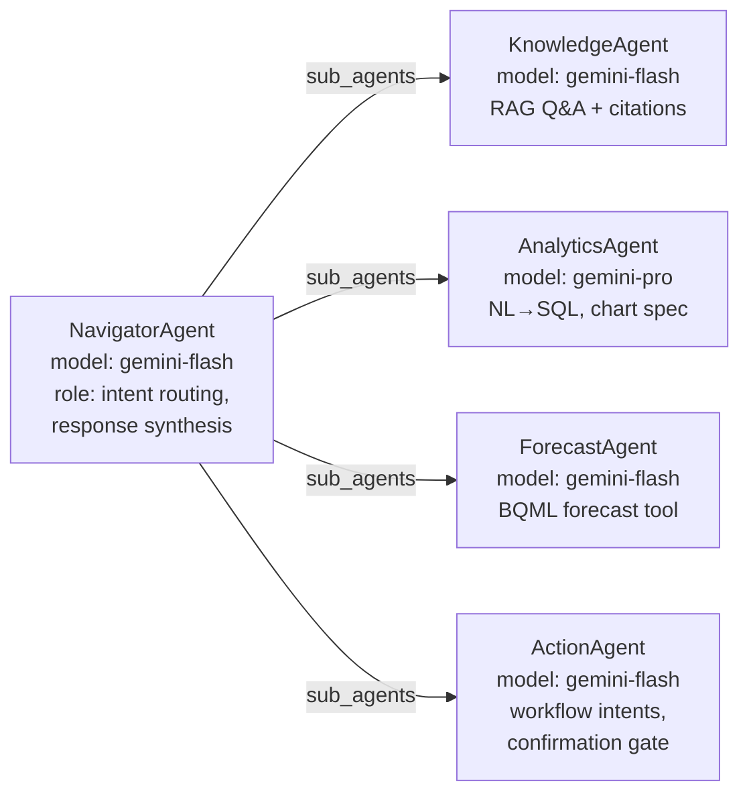
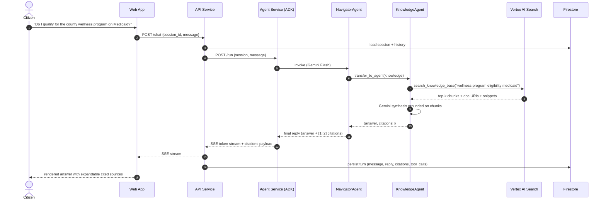
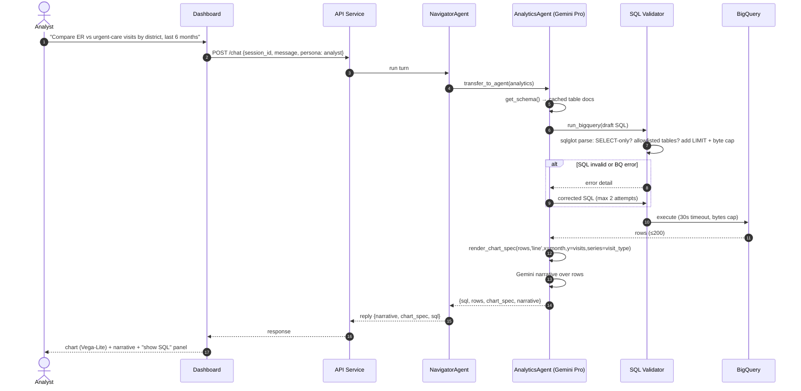
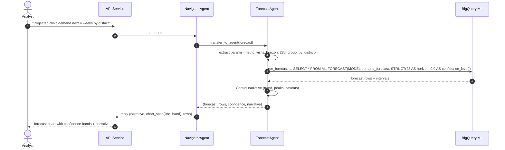
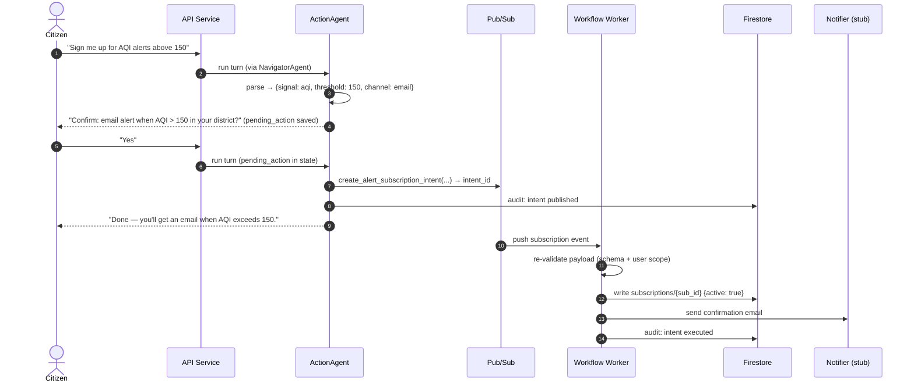
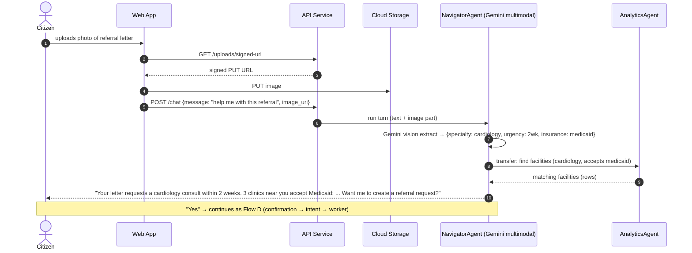
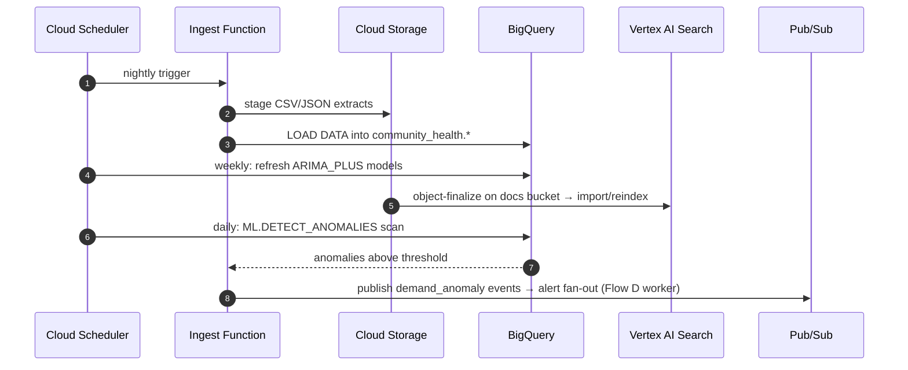

# Community Health Navigator — Architecture

**An AI-powered Decision Intelligence Platform for healthcare access and community wellness, built on Google Cloud.**

| | |
|---|---|
| Theme | Healthcare access & community wellness |
| Primary persona | Citizens seeking care, services, and wellness programs |
| Secondary persona | Community health workers / city stakeholders (analyst view) |
| Agent stack | Google Agent Development Kit (ADK) + Gemini on Vertex AI |
| Depth | Hackathon MVP, production-aware (scale-out notes in §14) |

---

## 1. Problem & Solution Summary

Communities generate large volumes of structured data (facility registries, utilization, environmental sensors, program enrollment) and unstructured data (program guides, eligibility policies, clinic notices, citizen feedback). Turning this into decisions is hard for both citizens ("Where can I get a low-cost dental checkup near me this week?") and stakeholders ("Which neighborhoods will see a spike in clinic demand next month?").

**Community Health Navigator** is a multi-agent conversational platform that:

1. **Answers natural-language questions** over both unstructured knowledge (RAG) and structured data (NL→SQL over BigQuery).
2. **Predicts outcomes** — clinic demand and wellness-risk forecasting via BigQuery ML.
3. **Detects anomalies** in community health signals (utilization spikes, AQI-driven symptom reports).
4. **Recommends** the nearest eligible services and wellness programs, with plain-language eligibility explanations.
5. **Automates workflows** — referral intake, alert subscriptions, and stakeholder notifications.
6. **Understands multimodal input** — a photo of a referral letter, prescription label, or flyer is parsed by Gemini's native vision.
7. **Is grounded and explainable** — every answer carries citations to source documents or the executed SQL, and safety filters gate all generations.

---

## 2. Personas & Core User Journeys

### 2.1 Citizen (chat UI)
- **J1 — Find care:** "I need a free flu shot near ZIP 43215 this weekend." → grounded answer with facility list, hours, eligibility, map links.
- **J2 — Understand eligibility:** "Do I qualify for the county wellness program if I'm on Medicaid?" → RAG over policy docs with cited passages.
- **J3 — Act:** "Book me into the community screening event" / "Alert me when AQI is bad for asthma." → workflow automation with confirmation.
- **J4 — Multimodal:** uploads a photo of a referral letter → agent extracts specialty, urgency, insurance, and finds matching providers.

### 2.2 Stakeholder / Analyst (dashboard + chat)
- **J5 — Ask the data:** "Compare ER visits vs. urgent-care utilization by neighborhood, last 6 months." → NL→SQL → chart + narrative.
- **J6 — Forecast:** "Projected clinic demand for the next 4 weeks by district." → BigQuery ML forecast + confidence bands.
- **J7 — Watch:** anomaly alerts pushed when signals deviate (e.g., respiratory complaints spike in one district).

---

## 3. High-Level Architecture



### Component responsibilities

| Component | Responsibility | Runs on |
|---|---|---|
| **Web App** | Chat UI (citizen), dashboard w/ charts (analyst), file upload, streaming responses | Firebase Hosting (static) |
| **API Service** | Auth, session management, request validation, SSE streaming to clients, persona routing | Cloud Run |
| **Agent Service** | Hosts the ADK runner; executes the multi-agent graph; tool invocation; grounding/citation assembly | Cloud Run |
| **Workflow Worker** | Consumes Pub/Sub events; executes side-effects (create referral record, send notification, evaluate alert rules) | Cloud Run |
| **Cloud Functions** | Scheduled ingestion (public datasets → BigQuery; docs → GCS → Vertex AI Search reindex); anomaly scan job | Cloud Functions gen2 |
| **Vertex AI Search** | Managed RAG: chunking, embedding, hybrid retrieval, citation metadata | Managed |
| **BigQuery (+ BQML)** | Structured analytics store; `ML.FORECAST` models; anomaly SQL jobs | Managed |
| **Firestore** | App state: sessions/conversation history, referrals, alert subscriptions, audit log | Managed |
| **Pub/Sub** | Decouples agent actions from side-effects; alert fan-out | Managed |

**Key boundary decisions (isolation & clarity):**
- **API vs. Agent are separate Cloud Run services.** The API owns HTTP/auth/session concerns and can be scaled and secured independently; the agent service is stateless per-turn and owns all LLM/tool logic. They communicate over an internal HTTP contract (§7.3).
- **Side-effects never happen inline in an agent turn.** `ActionAgent` only *publishes intents* to Pub/Sub; the Workflow Worker performs writes and notifications. This makes agent turns idempotent and retriable, and gives a natural human-in-the-loop insertion point.
- **All data access goes through typed tools** (§4.3) — agents never get raw DB handles, which bounds the blast radius of prompt injection and hallucinated queries.

---

## 4. Agent Design (Google ADK)

### 4.1 Agent topology



- **Pattern:** ADK `LlmAgent` root with `sub_agents` (LLM-driven delegation). The root classifies intent and transfers; sub-agents return structured results; root synthesizes the final user-facing reply.
- **Model tiering:** Gemini Flash for routing, RAG synthesis, forecasting narration, and action handling (latency-sensitive, low reasoning depth). Gemini Pro for `AnalyticsAgent` only — NL→SQL over a multi-table schema is the hardest reasoning task in the system. Model IDs live in config (§10), not code.
- **Multimodal:** no separate agent. Image parts are passed straight through to the root agent's Gemini call; extraction results (structured referral fields) are placed in session state for downstream agents.
- **Session state:** ADK session (backed by Firestore via a custom `SessionService`) carries `user_profile` (ZIP, language, coarse persona), `last_query_context`, and `pending_action` (for confirmation flows).

### 4.2 Agent contracts

| Agent | Input (from state/transfer) | Output (to state) | Tools |
|---|---|---|---|
| NavigatorAgent | user message (+ images), session state | final synthesized reply; delegation | `transfer_to_agent` (built-in) |
| KnowledgeAgent | user question | `{answer, citations: [{doc, page, snippet, uri}]}` | `search_knowledge_base` |
| AnalyticsAgent | analytical question | `{sql, rows, chart_spec, narrative}` | `get_schema`, `run_bigquery`, `render_chart_spec` |
| ForecastAgent | forecast request (metric, horizon, group_by) | `{forecast_rows, confidence, narrative}` | `run_forecast` |
| ActionAgent | action intent | `{action_type, params, status: pending_confirmation \| published}` | `create_referral_intent`, `create_alert_subscription_intent`, `list_my_items` |

### 4.3 Tool inventory (the only way agents touch data)

| Tool | Backing service | Signature (conceptual) | Safety constraints |
|---|---|---|---|
| `search_knowledge_base` | Vertex AI Search | `(query, filters?) → chunks[+metadata]` | Read-only; results carry source URIs for citation |
| `get_schema` | BigQuery INFORMATION_SCHEMA (cached) | `() → table/column descriptions` | Static allowlisted dataset only |
| `run_bigquery` | BigQuery | `(sql) → rows (max 200)` | SELECT-only validator (sqlglot parse); allowlisted tables; `maximum_bytes_billed` cap; 30 s timeout |
| `run_forecast` | BigQuery ML | `(metric, horizon_days, group_by?) → forecast rows` | Parameterized — agent never writes forecast SQL |
| `render_chart_spec` | pure function | `(rows, chart_type, x, y) → Vega-Lite spec` | No data egress; validated spec schema |
| `create_referral_intent` | Pub/Sub | `(specialty, facility_id, notes) → intent_id` | Requires `pending_action` confirmed by user; publishes only |
| `create_alert_subscription_intent` | Pub/Sub | `(signal, threshold, channel) → intent_id` | Same confirmation gate |
| `list_my_items` | Firestore | `(user_id) → referrals+subscriptions` | Scoped to session user_id server-side |

**Why tools, not direct access:** every mutation is (a) parameterized, (b) confirmation-gated in the conversation, and (c) executed asynchronously by the worker — so a prompt-injected or hallucinated tool call can at worst publish a well-typed intent that the worker validates again.

---

## 5. Data Architecture

### 5.1 BigQuery (dataset: `community_health`)

```sql
-- Facilities registry (seed: public HRSA/city open data + synthetic)
CREATE TABLE facilities (
  facility_id STRING NOT NULL,
  name STRING, category STRING,          -- clinic | hospital | pharmacy | community_center
  services ARRAY<STRING>,                -- e.g. ['flu_shot','dental','screening']
  address STRING, zip STRING, district STRING,
  lat FLOAT64, lon FLOAT64,
  hours JSON, accepts ARRAY<STRING>,     -- ['medicaid','uninsured','sliding_scale']
  cost_tier STRING                       -- free | low | standard
);

-- Daily utilization (synthetic time series for demo)
CREATE TABLE utilization_daily (
  date DATE, facility_id STRING, visit_type STRING,  -- er | urgent | primary | wellness
  visits INT64, avg_wait_minutes FLOAT64
);

-- Environmental signals
CREATE TABLE environment_daily (
  date DATE, district STRING, aqi INT64, pollen_index INT64, heat_index FLOAT64
);

-- Program enrollment
CREATE TABLE program_enrollment (
  date DATE, program_id STRING, program_name STRING,
  district STRING, enrollments INT64, capacity INT64
);
```

**BigQuery ML models** (created by ingestion job, refreshed weekly):

```sql
CREATE OR REPLACE MODEL community_health.demand_forecast
OPTIONS(model_type='ARIMA_PLUS', time_series_timestamp_col='date',
        time_series_data_col='visits', time_series_id_col='district')
AS SELECT date, district, SUM(visits) visits
   FROM community_health.utilization_daily u JOIN community_health.facilities f USING(facility_id)
   GROUP BY date, district;
```

Anomaly detection uses `ML.DETECT_ANOMALIES` over the same model, run daily by a scheduled Cloud Function; anomalies above threshold publish to Pub/Sub → alert fan-out.

### 5.2 Vertex AI Search datastore (`health-knowledge`)

Corpus (GCS bucket `gs://<proj>-health-docs/`, PDF/HTML/MD):
- Program guides & eligibility policies (county wellness, Medicaid navigation, sliding-scale rules)
- Facility FAQs, service descriptions, screening-event flyers
- Public-health guidance (vaccination schedules, AQI health advisories)

Configuration: unstructured datastore, chunk size ~500 tokens, hybrid (semantic + keyword) retrieval, `snippet` + `document.uri` + page metadata returned for citations. Reindex triggered by GCS object-finalize → Cloud Function.

### 5.3 Firestore collections

| Collection | Doc shape | Purpose |
|---|---|---|
| `sessions/{session_id}` | `{user_id, persona, created_at, state: {...adk state...}}` | ADK session persistence |
| `sessions/{id}/messages/{msg_id}` | `{role, content, citations?, tool_calls?, ts}` | Conversation history |
| `referrals/{referral_id}` | `{user_id, specialty, facility_id, status: received\|matched\|notified, notes, ts}` | Workflow output |
| `subscriptions/{sub_id}` | `{user_id, signal: 'aqi'\|'demand_anomaly', threshold, channel, active}` | Alert rules |
| `audit/{event_id}` | `{actor, action, params, intent_id, ts}` | Every published intent + worker execution |

---

## 6. Detailed Flows & Sequence Diagrams

### 6.1 Flow A — Citizen RAG Q&A with citations (J1/J2)

**Description.** A citizen asks an eligibility or find-care question. The API authenticates and loads the session, then invokes the agent service. NavigatorAgent classifies the intent as *knowledge* and transfers to KnowledgeAgent, which calls `search_knowledge_base`. Retrieved chunks (with source URIs) go back through Gemini for grounded synthesis; the root agent formats the final answer with numbered citations. If the question also needs structured facts (e.g., "near ZIP 43215"), KnowledgeAgent's answer is combined with an `AnalyticsAgent` facility lookup in the same turn (root orchestrates both transfers). The response streams to the UI via SSE; the full turn (message, citations, tool calls) is persisted to Firestore.



**Error paths:** retrieval returns 0 chunks → KnowledgeAgent answers "I don't have that in my sources" (no ungrounded generation) and suggests rephrasing; Vertex AI Search timeout (>5 s) → single retry, then graceful degradation message.

### 6.2 Flow B — Analyst NL→SQL analytics (J5)

**Description.** An analyst asks a comparative question. NavigatorAgent transfers to AnalyticsAgent (Gemini Pro). The agent first calls `get_schema` (cached table/column descriptions), drafts SQL, and passes it to `run_bigquery`, which **validates before executing**: parse with sqlglot, reject anything that is not a single SELECT on allowlisted tables, inject `LIMIT 200` and a bytes-billed cap. On SQL error, the error text is fed back to the agent for one self-correction loop (max 2 attempts). Result rows go to `render_chart_spec` (deterministic function → Vega-Lite) and to Gemini for a short narrative. The dashboard renders the chart client-side from the spec; the executed SQL is shown in an "explain" panel for transparency.



### 6.3 Flow C — Demand forecast (J6)

**Description.** Forecasting is deliberately *not* free-form SQL. ForecastAgent extracts `(metric, horizon, group_by)` from the request and calls `run_forecast`, which executes a fixed, parameterized `ML.FORECAST` query against the pre-trained ARIMA_PLUS model. The agent narrates the result (trend direction, peak districts, confidence) and returns rows for a confidence-band chart. If the requested metric has no trained model, the tool returns a typed `UnsupportedMetric` error and the agent lists what *is* forecastable.



### 6.4 Flow D — Workflow automation with confirmation gate (J3)

**Description.** Actions are two-phase. Phase 1: ActionAgent parses the request into a typed intent, stores it in session state as `pending_action`, and asks the user to confirm (human-in-the-loop). Phase 2: on "yes", the agent calls the intent tool, which publishes to Pub/Sub and writes an audit record — the agent turn ends there. The Workflow Worker consumes the event, re-validates the payload against the same schema, writes the `referrals`/`subscriptions` document, and sends the notification (email/SMS stub for MVP). Status is queryable via `list_my_items`.



**Alert firing (async):** Cloud Scheduler → Cloud Function runs the daily anomaly/threshold scan → matching subscriptions found in Firestore → Pub/Sub → Worker → notification. Same worker, same audit trail.

### 6.5 Flow E — Multimodal referral-letter upload (J4)

**Description.** The citizen uploads a photo. The web app puts the image in GCS via a signed URL from the API, then sends the chat turn with the GCS URI. The agent service passes the image part directly into the root agent's Gemini call with an extraction instruction; Gemini returns structured fields (`specialty, urgency, insurance, notes`). The root agent stores them in state, then transfers to AnalyticsAgent to find matching facilities (`accepts` includes the insurance, `services` includes the specialty), and finally offers to create a referral (rejoining Flow D).



**Privacy note (MVP):** uploads land in a bucket with 24 h lifecycle deletion; extracted fields are kept only in the session; no image content enters BigQuery or the RAG corpus.

### 6.6 Flow F — Data ingestion & index refresh (offline)

**Description.** Cloud Scheduler triggers ingestion functions: (1) nightly pull of public/synthetic datasets → staged in GCS → loaded to BigQuery; (2) weekly `CREATE OR REPLACE MODEL` refresh of BQML models; (3) doc drops into the docs bucket trigger Vertex AI Search reindex; (4) daily anomaly scan publishes alert events.



---

## 7. API Contracts

### 7.1 Public API (API Service, `/api/v1`)

| Endpoint | Method | Request | Response |
|---|---|---|---|
| `/chat` | POST | `{session_id?, message, image_uri?, persona: citizen\|analyst}` | SSE stream: `token`, `citations`, `chart_spec`, `action_request`, `done` events |
| `/sessions` | POST | `{persona}` | `{session_id}` |
| `/sessions/{id}/messages` | GET | — | `[{role, content, citations?, chart_spec?, ts}]` |
| `/uploads/signed-url` | GET | `?content_type=image/jpeg` | `{put_url, gcs_uri}` |
| `/me/items` | GET | — | `{referrals: [...], subscriptions: [...]}` |
| `/healthz` | GET | — | `{status, deps: {firestore, agent}}` |

**SSE event schema** (one JSON object per event):

```json
{"event": "token", "data": {"text": "..."}}
{"event": "citations", "data": [{"n": 1, "title": "...", "uri": "...", "snippet": "..."}]}
{"event": "chart_spec", "data": {"vega_lite": {...}, "sql": "SELECT ..."}}
{"event": "action_request", "data": {"intent": "alert_subscription", "params": {...}, "confirm_token": "..."}}
{"event": "done", "data": {"latency_ms": 2140, "agents_used": ["navigator","knowledge"]}}
```

### 7.2 Auth (MVP)

Firebase Authentication (anonymous for citizens, email for analysts); the API verifies the ID token and derives `user_id`/`persona`. `analyst` endpoints/personas enforced by custom claim. *(Production: see §14.)*

### 7.3 Internal contract API → Agent Service

`POST /run` `{session_id, user_id, persona, message, image_uri?}` → SSE stream of ADK events (mapped 1:1 to the public SSE schema by the API service). The agent service is not publicly routable (Cloud Run ingress: internal).

---

## 8. Tool & Service Analysis

Why each service was chosen, what it does here, and its alternative — so the choices are defensible in judging and swappable in code.

| Service | Role here | Why this over alternatives | Alternative considered | MVP? |
|---|---|---|---|---|
| **Gemini (Flash + Pro) on Vertex AI** | All reasoning, routing, synthesis, vision extraction | Native multimodal, one SDK, tiering controls latency/cost; hackathon alignment | Claude/GPT via API — weaker GCP-integration story | ✅ |
| **Agent Development Kit (ADK)** | Multi-agent orchestration, tool calling, session/state, transfer semantics | Purpose-built for Gemini agents; `sub_agents` delegation matches our topology; local runner for dev; deployable to Agent Engine later | LangGraph (team knows it well) — more control but a weaker "Google-native" narrative; kept as known fallback if ADK blocks | ✅ |
| **Vertex AI Search** | Managed RAG (chunking, embeddings, hybrid retrieval, citations) | Zero-infra RAG with citation metadata out of the box; days-scale buildable | DIY RAG (AlloyDB pgvector + embeddings API) — more control over chunking/rerank, ~3–5 days extra work | ✅ |
| **BigQuery** | Analytics store + NL→SQL target | Serverless, public-dataset ecosystem, INFORMATION_SCHEMA for schema tool, cost caps per query | AlloyDB — better OLTP, worse fit for analyst-scale scans | ✅ |
| **BigQuery ML (ARIMA_PLUS)** | Demand forecasting + anomaly detection | Forecast + `ML.DETECT_ANOMALIES` in pure SQL, no training infra | Vertex AI custom model / TimesFM — better accuracy ceiling, heavy for MVP | ✅ |
| **Cloud Run** | API, Agent, Worker services | Scale-to-zero, container-native, SSE support, internal ingress between services | GKE — overkill; Cloud Functions — poor fit for streaming | ✅ |
| **Firestore** | Sessions, referrals, subscriptions, audit | Serverless, per-doc security, easy real-time reads from web app | AlloyDB — relational rigor but needs schema/migrations/connection mgmt; wrong trade for MVP state | ✅ |
| **Pub/Sub** | Action-intent bus, alert fan-out | At-least-once + retry + DLQ gives idempotent side-effects for free | Cloud Tasks — fine for point-to-point, weaker fan-out | ✅ |
| **Cloud Functions gen2 + Scheduler** | Ingestion, model refresh, anomaly scan | Event-driven glue with minimal code | Cloud Composer — heavyweight for 3 jobs | ✅ |
| **Cloud Storage** | Raw docs, image uploads (24 h lifecycle) | Signed URLs keep image bytes off the API path | — | ✅ |
| **Firebase Hosting + Auth** | Static frontend + identity | Fastest path to authenticated demo | Cloud Run-served frontend; Identity Platform | ✅ |
| **Looker Studio** | Stakeholder ambient dashboard (non-conversational) | Free, connects to BigQuery directly; complements in-app Vega-Lite charts | Custom dashboard only | ◐ optional |
| **Vertex AI Agent Engine** | Managed agent runtime | Managed sessions/scaling for ADK | — | ✖ scale-out (§14) |
| **Cloud Logging/Trace** | Structured logs, per-turn trace spans, tool-call logging | Built-in; ADK emits events we log with `session_id` correlation | Langfuse/W&B — richer LLM evals, extra setup | ✅ (basic) |

**Cost posture (hackathon):** everything above is serverless/scale-to-zero; the only meaningful variable costs are Gemini tokens and BigQuery bytes — both capped (token limits per turn; `maximum_bytes_billed=1GB` per query).

---

## 9. Responsible & Explainable AI

- **Grounding:** KnowledgeAgent answers only from retrieved chunks; zero-retrieval → explicit "not in my sources." Citations rendered with every RAG answer.
- **Transparency:** analysts see the executed SQL; forecasts display confidence intervals and a "model: ARIMA_PLUS, trained on X" caveat line.
- **Safety:** Vertex AI safety settings on all Gemini calls; system instructions prohibit medical diagnosis/advice — the assistant navigates to care, it does not practice it. A standing disclaimer renders on citizen persona ("informational, not medical advice; call 911 / local emergency line for emergencies"). Emergency-intent detection in NavigatorAgent short-circuits to emergency guidance.
- **Injection containment:** typed tools only; SELECT-only SQL validator; two-phase confirmed actions; worker-side revalidation.
- **Privacy:** no PHI stored — public + synthetic data only; uploaded images auto-delete in 24 h; sessions keyed to anonymous auth IDs.
- **Audit:** every intent publication and execution is written to `audit/` with actor, params, and timestamps.

---

## 10. Configuration & Environments

Single `config.yaml` (mounted via Cloud Run env / Secret Manager for keys):

```yaml
project_id: <gcp-project>
region: us-central1
models:
  router: gemini-flash        # pin exact versions at deploy time
  analytics: gemini-pro
bigquery:
  dataset: community_health
  max_bytes_billed: 1073741824
  row_limit: 200
rag:
  datastore_id: health-knowledge
  top_k: 8
limits:
  max_turn_tokens: 4096
  sql_retry_attempts: 2
  tool_timeout_s: 30
```

Environments: `dev` (local ADK runner + emulators) and `demo` (single GCP project). No staging tier for hackathon.

---

## 11. Error Handling & Resilience

| Failure | Behavior |
|---|---|
| Gemini timeout/5xx | 1 retry w/ backoff; then friendly failure message; turn logged with error class |
| Tool timeout (30 s) | Typed `ToolTimeout` returned to agent → agent apologizes + suggests retry; never hangs the SSE stream |
| Invalid SQL ×3 | Return "I couldn't build a reliable query for that" + the closest schema hints; log for prompt iteration |
| Pub/Sub delivery failure | At-least-once redelivery; worker idempotent on `intent_id`; DLQ after 5 attempts + audit entry |
| Vertex AI Search empty/err | No-hallucination fallback (§9); retry once |
| SSE client disconnect | Agent turn is cancelled server-side; partial turn persisted with `interrupted: true` |
| Worker crash mid-action | Firestore write is the commit point; notification retried; audit shows exact stage |

---

## 12. Testing Strategy

- **Unit:** SQL validator (allowlist, SELECT-only, injection strings); chart-spec renderer; intent schema validation; Firestore session service. Pure-Python, no cloud deps (mock clients).
- **Agent evals (deterministic-ish):** golden-set of ~30 prompts per agent (routing correctness, NL→SQL exact-match on canonical questions, RAG answer-contains-citation checks) run via ADK's local runner against recorded tool fixtures; LLM-judge scoring for narrative quality (optional).
- **Integration:** docker-compose-style local stack — ADK runner + Firestore emulator + BigQuery against a `test` dataset; Flow A/B/D exercised end-to-end.
- **Smoke (deployed):** `/healthz` + one scripted turn per flow post-deploy (Cloud Build step).

---

## 13. Repository Layout (codegen target)

```
community-health-navigator/
├── services/
│   ├── api/                    # FastAPI: auth, sessions, SSE bridge, signed URLs
│   │   ├── main.py
│   │   ├── routes/ (chat.py, sessions.py, uploads.py, me.py)
│   │   ├── sse.py              # ADK-event → public SSE mapping
│   │   └── auth.py             # Firebase token verification
│   ├── agent/                  # ADK app
│   │   ├── main.py             # /run endpoint wrapping ADK Runner
│   │   ├── agents/ (navigator.py, knowledge.py, analytics.py, forecast.py, action.py)
│   │   ├── tools/ (rag.py, bigquery.py, forecast.py, charts.py, intents.py)
│   │   ├── validators/sql_guard.py
│   │   └── sessions/firestore_session_service.py
│   └── worker/                 # Pub/Sub consumer
│       ├── main.py
│       ├── handlers/ (referral.py, subscription.py, alerts.py)
│       └── notifier.py         # email stub
├── functions/                  # Cloud Functions gen2
│   ├── ingest_datasets/
│   ├── refresh_models/
│   ├── anomaly_scan/
│   └── reindex_docs/
├── web/                        # React (Vite): chat UI, dashboard, upload, vega-lite
├── data/
│   ├── ddl/                    # BigQuery DDL + BQML model SQL (§5.1)
│   ├── seed/                   # synthetic CSVs + generator script
│   └── docs/                   # sample knowledge corpus
├── infra/
│   ├── setup.sh                # gcloud provisioning (APIs, datasets, datastore, topics)
│   └── cloudbuild.yaml         # build + deploy 3 Cloud Run services + functions
├── evals/                      # golden sets + runner
├── config.yaml
└── shared/                     # pydantic schemas: intents, SSE events, tool I/O
```

The `shared/` pydantic schemas are the single source of truth for intent payloads and SSE events — imported by api, agent, worker, and mirrored as TypeScript types in `web/` (generated via `datamodel-code-generator`/`json-schema-to-typescript`).

---

## 14. Scale-Out Later (production path, out of MVP scope)

- **Runtime:** move ADK app to **Vertex AI Agent Engine** (managed sessions, autoscaling); API stays on Cloud Run behind **API Gateway** + Cloud Armor.
- **Identity & access:** Identity Platform with MFA for analysts; per-district row-level security in BigQuery; VPC-SC perimeter around data services.
- **Compliance:** if real PHI ever enters, HIPAA-eligible services + BAA, CMEK on GCS/BQ/Firestore, DLP API scanning on uploads, retention policies.
- **Data:** streaming ingestion (Pub/Sub → Dataflow → BigQuery) for real-time signals; AlloyDB for transactional workloads if referral volume grows; dbt for transformation lineage.
- **ML:** upgrade forecasting to Vertex AI TimesFM/custom models with backtesting; Vertex AI Model Monitoring; RAG reranking + freshness pipelines.
- **Quality:** Vertex AI Gen AI Evaluation service in CI; Langfuse-style tracing; canary deploys with turn-level A/B on prompts.
- **Multi-tenancy:** per-city dataset + datastore isolation, tenant-scoped config.

---

## 15. Build Order (suggested milestones)

1. **M1 — Skeleton:** infra/setup.sh, BigQuery DDL + seed data, Firestore, one Cloud Run API with `/healthz`, React shell.
2. **M2 — Flow B:** AnalyticsAgent + SQL guard end-to-end (highest technical risk; validates ADK + BigQuery early).
3. **M3 — Flow A:** docs corpus → Vertex AI Search → KnowledgeAgent with citations; NavigatorAgent routing between A and B.
4. **M4 — Flows C & D:** BQML model + ForecastAgent; ActionAgent + Pub/Sub + worker + confirmation UX.
5. **M5 — Flow E + polish:** multimodal upload, dashboard charts, disclaimers, audit, evals, demo script.
